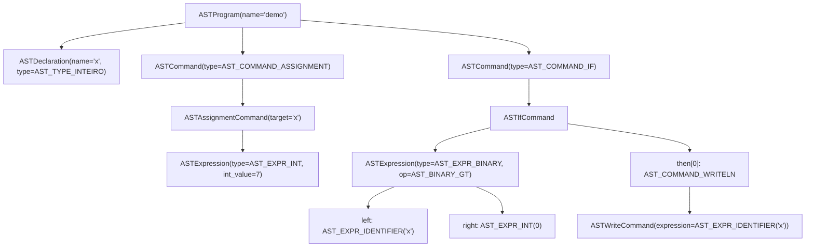
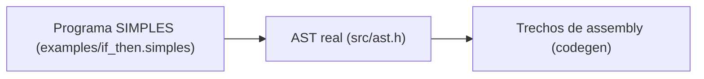
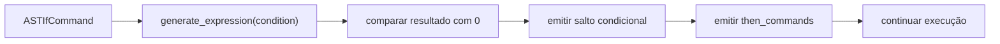

# Aula Técnica: AST real e geração de assembly no compilador SIMPLES

## Objetivo

Este material mostra uma visão mais fiel à implementação do compilador SIMPLES.

Em vez de trabalhar apenas com a ideia geral do pipeline, aqui o foco é:

- a AST real usada pelo projeto
- os tipos e estruturas definidos em `src/ast.h`
- a passagem da AST para trechos reais do assembly gerado

## Programa-base

O estudo de caso desta aula é o arquivo `examples/if_then.simples`:

```simples
programa demo
inteiro x;
inicio
  x <- 7;
  se x > 0 entao
    escreval x;
  fimse
fim
```

Esse exemplo é pequeno, mas já contém os elementos necessários para discutir:

- declaração
- atribuição
- expressão binária relacional
- comando `if`
- comando de escrita

## 1. FIRST/FOLLOW antes da AST

Antes da AST existir, o parser ainda está decidindo **qual produção da gramática** reconheceu.

É nesse ponto que entram as ideias de `FIRST`, `FOLLOW` e lookahead.

Para a parte de comandos, a gramática do projeto inclui:

```ebnf
<comando>         ::= <atribuicao>
                    | <cmd_leia>
                    | <cmd_escreva>
                    | <cmd_se>
                    | <cmd_enquanto>
                    | <cmd_para>
                    | <cmd_chamada>
                    | <cmd_retorna>

<atribuivel>      ::= ID | <acesso_indexado>
<atribuicao>      ::= <atribuivel> "<-" <expressao> ";"
<cmd_chamada>     ::= ID "(" [ <argumentos> ] ")" ";"
<acesso_indexado> ::= ID "[" <expressao> "]" [ "[" <expressao> "]" ]
```

### Onde entra o FIRST

Se olharmos apenas o começo da produção:

- `FIRST(<atribuicao>)` inclui `ID`
- `FIRST(<cmd_chamada>)` também inclui `ID`

Ou seja: **só o primeiro token não basta** para distinguir uma atribuição de uma chamada.

É por isso que o parser real precisa olhar o próximo token depois do identificador, como acontece em `src/parser.c:1165-1235`.

Na prática, a decisão fica assim:

- `x <- 7;` leva a `AST_COMMAND_ASSIGNMENT`
- `nome(...)` levaria a `AST_COMMAND_CALL`
- `vetor[0] <- 1;` continua sendo atribuição, mas com alvo indexado

### Onde entra o FOLLOW

Depois que a atribuição termina, o parser precisa saber o que pode aparecer **em seguida** dentro do bloco atual.

Em termos didáticos, o `FOLLOW(<atribuicao>)` ajuda a enxergar que, após a produção ser concluída, o fluxo pode continuar com:

- outro comando
- ou um token de fechamento/continuação de bloco

Por isso, um exemplo secundário útil é `examples/if_then_else.simples`:

```simples
programa demo
inteiro x;
inicio
  x <- -1;
  se x > 0 entao
    escreval x;
  senao
    escreval 0;
  fimse
fim
```

Nele, após um comando dentro do bloco do `if`, o parser pode encontrar tokens como `senao` ou `fimse`, que funcionam como marcadores de continuação ou encerramento da estrutura.

No próprio parser (veja `src/parser.c`) isso é tratado com arrays de terminadores — por exemplo `then_terminators` e `else_terminators` — usados em conjunto com a função `parse_command_list` para decidir onde parar ao ler comandos em cada contexto. Este segundo exemplo é útil porque demonstra que o FOLLOW é contextual: `senao` atua como terminador da lista "then" (indica a transição para o bloco `else`) mas não termina a lista `else` — na lista `else` o token finalizador é `fimse`.

### Relação com a AST

O ponto principal é este:

`AST_COMMAND_ASSIGNMENT` ainda não existe enquanto o parser está apenas olhando `ID`.

Esse nó só aparece **depois** que a produção correta foi reconhecida.

Então, `FIRST`/`FOLLOW` ajudam o parser a decidir **qual comando ele está lendo**; só depois disso a AST é construída.

## 2. Mapa das estruturas reais da AST

Para esse programa, as estruturas mais importantes em `src/ast.h` são:

- `ASTProgram`
- `ASTDeclaration`
- `ASTCommand`
- `ASTAssignmentCommand`
- `ASTIfCommand`
- `ASTWriteCommand`
- `ASTExpression`
- `ASTBinaryOp`

Em termos de organização, o compilador representa o programa como:

- um `ASTProgram`
- com uma lista de declarações (`ASTDeclaration`)
- e uma lista de comandos (`ASTCommand`)

Dentro dessa lista de comandos, o nosso exemplo possui:

1. uma atribuição `x <- 7`
2. um comando `if`

Dentro do `if`, a condição `x > 0` é uma expressão binária, e o bloco `then` contém um comando `escreval x`.

## 3. AST real do programa

Usando os nomes reais do projeto, a estrutura central do exemplo pode ser resumida assim:



### Representação textual próxima das structs

```text
ASTProgram {
  name = "demo"
  declarations = [
    ASTDeclaration {
      name = "x"
      type = AST_TYPE_INTEIRO
      storage = AST_STORAGE_SCALAR
    }
  ]
  commands = [
    ASTCommand {
      type = AST_COMMAND_ASSIGNMENT
      assignment = ASTAssignmentCommand {
        target = ASTAssignmentTarget {
          type = AST_TARGET_IDENTIFIER
          identifier = "x"
        }
        expression = ASTExpression {
          type = AST_EXPR_INT
          int_value = 7
        }
      }
    },
    ASTCommand {
      type = AST_COMMAND_IF
      if_command = ASTIfCommand {
        condition = ASTExpression {
          type = AST_EXPR_BINARY
          binary.op = AST_BINARY_GT
          binary.left = ASTExpression {
            type = AST_EXPR_IDENTIFIER
            identifier = "x"
          }
          binary.right = ASTExpression {
            type = AST_EXPR_INT
            int_value = 0
          }
        }
        then_commands = [
          ASTCommand {
            type = AST_COMMAND_WRITELN
            write = ASTWriteCommand {
              expression = ASTExpression {
                type = AST_EXPR_IDENTIFIER
                identifier = "x"
              }
            }
          }
        ]
        else_commands = []
        else_count = 0
      }
    }
  ]
}
```

## 4. Onde essa árvore nasce e é validada

No parser, o trecho `se x > 0 entao ... fimse` é reconhecido como um comando do tipo `AST_COMMAND_IF`. Veja a construção concreta do AST para esse caso em `src/parser.c:1302-1338`, que mostra como o parser monta o nodo `ASTIfCommand` e suas sub-estruturas.

Nesse processo:

- a condição `x > 0` vira uma `ASTExpression` do tipo `AST_EXPR_BINARY`
- o operador `>` é armazenado como `AST_BINARY_GT`
- os comandos dentro do bloco `then` entram no vetor `then_commands` de `ASTIfCommand`

Em seguida, a análise semântica valida essa estrutura (ver `src/semantic.c:1085-1108`), onde são feitas checagens de declaração, tipos e uso correto das expressões.

Para o nosso exemplo, isso inclui confirmar que:

- `x` foi declarada
- `x <- 7` é uma atribuição válida
- `x > 0` é uma condição aceitável
- `escreval x` usa uma expressão bem tipada

Em outras palavras: o parser organiza a estrutura, e a semântica confirma que essa estrutura faz sentido para o compilador.

## 5. Como a AST vira assembly real

Quando o codegen encontra o `AST_COMMAND_IF`, ele já não trabalha mais com palavras como `se` e `entao`.

Nesse ponto, o compilador já possui uma estrutura interna pronta para ser baixada para assembly:

- a condição está em `ASTIfCommand.condition`
- o bloco verdadeiro está em `ASTIfCommand.then_commands`
- o operador relacional já foi resolvido como `AST_BINARY_GT`



### Fluxo de lowering do `if`



### Trechos representativos do assembly

Para o nosso exemplo, os trechos mais importantes do assembly gerado representam estas ideias:

1. carregar ou materializar o valor da expressão
2. comparar o resultado da condição
3. saltar se a condição for falsa
4. executar o bloco do `then`
5. continuar o fluxo do programa

```asm
; atribuição x <- 7
mov dword [x], 7

; condição x > 0
mov eax, dword [x]
push eax
mov eax, 0
mov ebx, eax
pop eax
cmp eax, ebx
setg al
movzx eax, al
cmp eax, 0
je .Lendif0

; then: escreval x
mov eax, dword [x]
call print_int
call print_newline

.Lendif0:
```

Os rótulos exatos podem variar, mas a estrutura do lowering é essa: avaliar, comparar, desviar, executar o bloco, seguir adiante.

## 6. Mapeamento AST → Assembly

| Estrutura da AST | Papel no programa | Efeito no assembly |
| --- | --- | --- |
| `ASTDeclaration` de `x` | declara uma variável inteira | reserva/usa um símbolo associado à variável |
| `AST_COMMAND_ASSIGNMENT` | realiza `x <- 7` | grava o literal diretamente em memória |
| `AST_EXPR_BINARY` com `AST_BINARY_GT` | representa `x > 0` | gera comparação, `setg` e salto condicional |
| `ASTIfCommand` | organiza condição e bloco `then` | controla emissão de rótulo e desvio |
| `AST_COMMAND_WRITELN` | imprime `x` com quebra de linha | gera chamadas `print_int` e `print_newline` |

## 7. Fechamento técnico

Neste material, o ponto principal é que a AST não é uma abstração inventada apenas para ensino: ela é a estrutura real usada pelo compilador para organizar o programa antes da geração de código.

O caminho do `if` no compilador pode ser lido assim:

- o parser cria `AST_COMMAND_IF`
- a condição vira `AST_EXPR_BINARY` com `AST_BINARY_GT`
- a semântica valida a estrutura
- o codegen transforma essa estrutura em comparação, salto e bloco emitido em assembly

Ou seja: o `if` continua existindo do início ao fim do processo, mas muda de forma. Primeiro ele aparece como sintaxe da linguagem, depois como árvore estruturada, e por fim como controle de fluxo em assembly.
