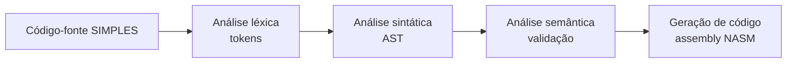
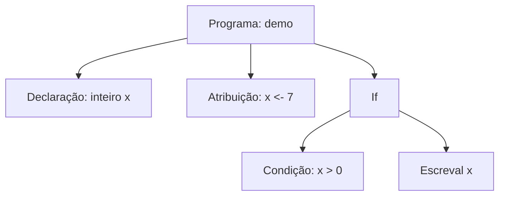
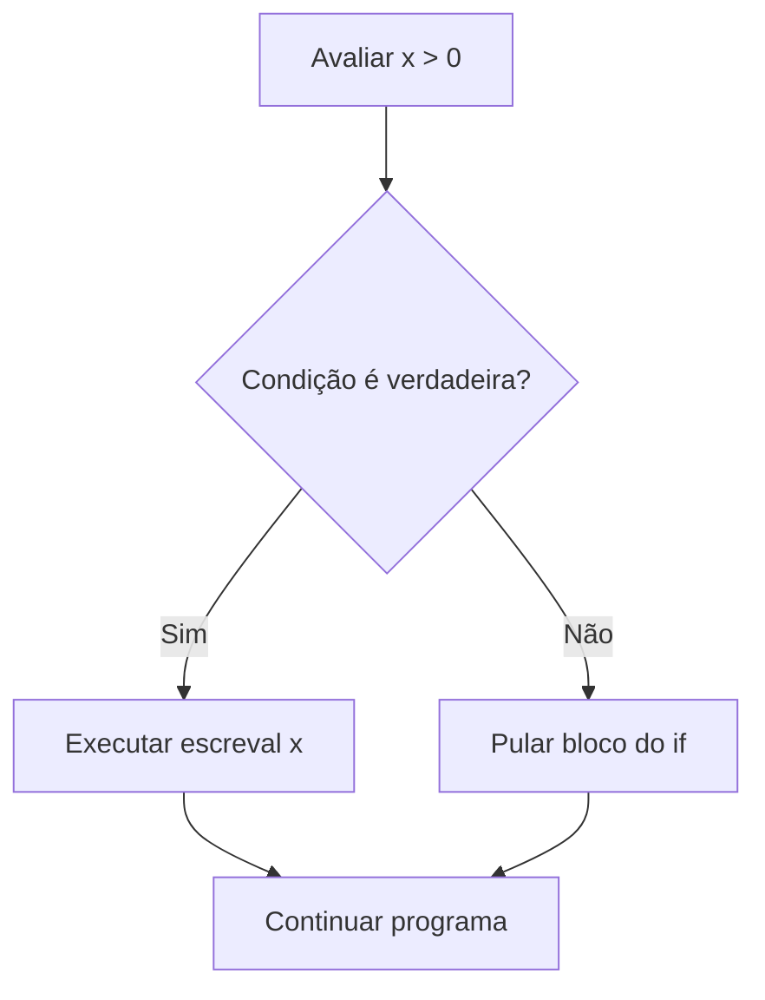

# Aula: Como funciona o processo de compilação no SIMPLES

## Objetivo da aula

- Entender o que significa compilar um programa.
- Visualizar as etapas do compilador SIMPLES.
- Acompanhar um exemplo com `se ... entao` da entrada até o assembly.

## Ideia central

Compilar é transformar um programa escrito em uma linguagem mais próxima do ser humano em uma representação estruturada que possa ser executada pela máquina.

No compilador SIMPLES deste repositório, o processo acontece em quatro fases principais:

1. análise léxica
2. análise sintática
3. análise semântica
4. geração de código

## Visão geral do pipeline



## Exemplo que vamos acompanhar

```simples
programa demo
inteiro x;
inicio
  x <- 7;
  se x > 0 entao
    escreval x;
  fimse
fim
```

Esse programa é pequeno, mas já mostra:

- declaração de variável
- atribuição
- comparação relacional
- estrutura de controle `se ... entao`
- saída com `escreval`

## 1. Análise léxica

Na análise léxica, o compilador lê o texto caractere por caractere e agrupa trechos com significado em **tokens**.

Para o compilador, `programa`, `inteiro`, `se`, `entao` e `fimse` não são mais apenas palavras soltas: cada uma vira um item identificado com uma categoria própria.

### Tokens do exemplo

| Trecho do código | Categoria |
| --- | --- |
| `programa` | palavra-chave |
| `demo` | identificador |
| `inteiro` | palavra-chave de tipo |
| `x` | identificador |
| `;` | delimitador |
| `inicio` | palavra-chave de início de bloco |
| `<-` | operador de atribuição |
| `7` | literal inteiro |
| `se` | palavra-chave de controle |
| `>` | operador relacional |
| `0` | literal inteiro |
| `entao` | palavra-chave |
| `escreval` | palavra-chave de saída |
| `fimse` | palavra-chave de fechamento |
| `fim` | palavra-chave de fim de bloco |

### O que entra e o que sai

- **Entrada:** texto-fonte
- **Saída:** sequência de tokens

Se houver um caractere inválido nessa fase, o compilador nem chega ao parser.

## 2. Análise sintática

Na análise sintática, o compilador verifica se os tokens aparecem em uma ordem válida segundo a gramática da linguagem.

Se tudo estiver correto, ele monta uma **AST** (*Abstract Syntax Tree*), isto é, uma árvore que representa a estrutura do programa.

O ponto importante é que a AST não guarda o programa como texto puro. Ela guarda a **estrutura**: atribuição, condição, bloco do `se`, comando de escrita e assim por diante.

### AST simplificada do exemplo



### O que entra e o que sai

- **Entrada:** tokens
- **Saída:** AST

Se faltar `fimse`, `;` ou outro elemento obrigatório da gramática, o erro aparece aqui.

## 3. Análise semântica

Mesmo que o programa esteja sintaticamente correto, ainda é preciso verificar se ele **faz sentido**.

É isso que a análise semântica faz.

No nosso exemplo, ela confirma pontos como:

- `x` foi declarada antes de ser usada
- `x` pode receber o valor inteiro `7`
- a condição `x > 0` é válida
- `escreval x` usa uma variável conhecida pelo compilador

### O que entra e o que sai

- **Entrada:** AST
- **Saída:** AST validada, com apoio da tabela de símbolos

Se o programa tentasse usar `y > 0` sem declarar `y`, o erro seria semântico, não léxico nem sintático.

## 4. Geração de código

Depois que o programa passou pelas fases anteriores, o gerador de código pode transformar a estrutura validada em assembly.

No compilador SIMPLES deste repositório, a saída é um arquivo NASM x86 32-bit para Linux.

No caso do `se ... entao`, a ideia geral do backend é:

1. avaliar a expressão da condição
2. comparar o resultado
3. desviar se a condição for falsa
4. executar o bloco do `entao` se a condição for verdadeira
5. continuar a execução do programa

### Fluxo simplificado do `se ... entao`



### Intuição do assembly gerado

Em vez de guardar a palavra `se`, o assembly trabalha com instruções de comparação, saltos condicionais e rótulos.

Ou seja: a intenção lógica do `if` continua existindo, mas agora em uma forma que o processador entende.


## Fechamento

Podemos resumir o processo de compilação assim:

- o **lexer** transforma texto em tokens
- o **parser** transforma tokens em estrutura
- o **semantic** verifica se essa estrutura faz sentido
- o **codegen** transforma a estrutura validada em assembly

Separar o compilador em fases ajuda porque cada etapa resolve um tipo diferente de problema.

Isso facilita:

- entender o compilador
- testar cada parte isoladamente
- localizar erros com mais precisão
- evoluir a linguagem com mais segurança

## Resumo final das entradas e saídas

| Fase | Entrada | Saída |
| --- | --- | --- |
| Análise léxica | código-fonte | tokens |
| Análise sintática | tokens | AST |
| Análise semântica | AST | AST validada |
| Geração de código | AST validada | assembly |

